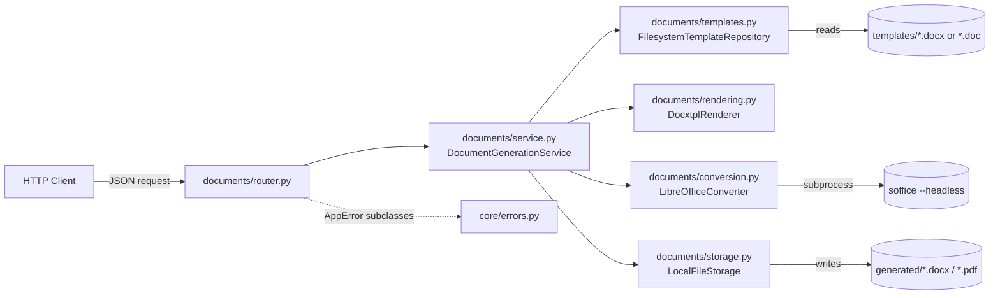
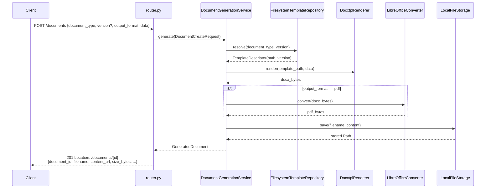
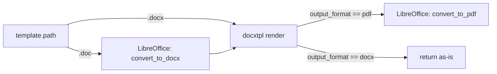

# Architecture (current state — POC)

This describes the system as it exists today: a single-process FastAPI
service, structured as a **modular monolith**, with no database, no
external storage, and no auth. See [`production-readiness.md`](./production-readiness.md)
for how each POC shortcut maps to a real-service equivalent.

## Goals this architecture optimizes for

1. **Correctness of the core generation pipeline** (template resolution → render → optional PDF conversion → store) over infrastructure completeness.
2. **Zero-code-change extensibility** for new document types.
3. **A module boundary that survives the jump to production** — nothing here needs to be re-architected when a database, object storage, or a queue is introduced; those slot in behind the same seams.

## High-level component diagram



## Module layout

```
app/
├── main.py             Composition root: builds the FastAPI app, mounts modules
├── core/                Cross-cutting concerns shared by every (current and future) module
│   ├── config.py          Settings, env-driven (DOCKET_* variables)
│   ├── exceptions.py      AppError base class — carries an HTTP status_code
│   └── errors.py          Single exception handler registered for AppError
└── modules/
    └── documents/        The one business capability this POC implements
        ├── router.py        HTTP routes — translation only, no business logic
        ├── schemas.py        Pydantic request/response models (also used as service input)
        ├── service.py        DocumentGenerationService — orchestrates the 4 steps below
        ├── templates.py      Step 1: resolve document_type (+version) -> template file
        ├── rendering.py      Step 2: render Jinja2/docxtpl data into the DOCX
        ├── conversion.py     Step 3 (optional): DOCX -> PDF via headless LibreOffice
        ├── storage.py        Step 4: persist bytes to disk, resolve document_id back to a file
        └── exceptions.py     TemplateNotFoundError, TemplateRenderError, etc.
```

Each file in `modules/documents/` owns exactly one step of the pipeline.
`service.py` is the only file that knows the *order* of the steps; every
other file is a self-contained, independently testable unit with a
narrow interface (one class, 1-3 public methods).

## API surface (REST resource model)

`documents` is a collection resource; `document-types` is a separate,
read-only one (a type/template isn't a document — it's what a document
is generated *from*). Nouns in the path, verbs via HTTP method — see
ADR-012 in [`design-decisions.md`](./design-decisions.md) for why this
replaced an earlier action-style `/documents/generate` +
`/documents/download/{filename}` pair.

| Method | Path | Purpose |
|---|---|---|
| `POST` | `/api/v1/documents` | Create (generate) a document |
| `GET` | `/api/v1/documents` | List previously generated documents |
| `GET` | `/api/v1/documents/{document_id}` | Read one document's metadata |
| `GET` | `/api/v1/documents/{document_id}/content` | Fetch the actual file bytes |
| `DELETE` | `/api/v1/documents/{document_id}` | Delete a generated document |
| `GET` | `/api/v1/document-types` | List available document types/versions |

No `PUT`/`PATCH`: a generated document is an immutable artifact — to get
a different rendering, `POST` a new one rather than mutating an existing
one. `document_id` is a 32-character lowercase-hex id (`uuid4().hex`),
validated as a path parameter (`pattern=^[0-9a-f]{32}$`) — a malformed id
never reaches the storage layer, it's rejected as a `422
VALIDATION_ERROR` by routing itself.

## Request flow: `POST /api/v1/documents`



`content_url` is built with `request.url_for(...)`, so it's an
absolute, directly-`curl`-able URL reflecting the host the client
actually used — never the server's internal filesystem path. Earlier
this endpoint returned `file_path` (e.g. `/app/generated/....docx`),
the *container's* path, which is meaningless to a client and was a
recurring source of confusion; see ADR-011 in
[`design-decisions.md`](./design-decisions.md).

The response includes a `Location` header pointing at
`GET /documents/{document_id}` — the standard REST convention for what a
`201 Created` should carry, so a client never has to string-build that
URL itself either.

## Addressing a document without a database

There is still no database (ADR-010). `GET/DELETE /documents/{id}` and
`GET /documents` work anyway because `_build_filename` in `service.py`
embeds the full `document_id`, `document_type`, `version`, and a
microsecond-precision timestamp directly into the filename it writes
(e.g. `invoice_v1_20260705T030041771156Z_bc966a14....docx`). `find_by_id`
in `storage.py` reverses that with a glob on `*_{document_id}.*`, and
`_parse_generated_file` in `service.py` reverses the rest with a regex —
the filename *is* the record. This is why `GET /documents` can list
documents sorted newest-first with zero persistence: `created_at` is
parsed back out of the timestamp segment, not stored anywhere separately.

Every step can fail independently and each failure maps to a distinct,
already-correct HTTP status via `AppError.status_code`
(`TemplateNotFoundError` → 404, `TemplateRenderError` → 422,
`ConversionUnavailableError` → 503, `DocumentConversionError` → 502,
`DocumentStorageError` → 500). There is no generic 500 "something broke"
response for any expected failure mode. Every error — including request
validation failures and generic HTTP errors — is returned in one
consistent envelope: `{"error": {"code", "message", "request_id", "fields"?}}`.
See "Error envelope" below.

## Template formats: `.docx` and legacy `.doc`

`FilesystemTemplateRepository` discovers both extensions (`.docx`
preferred when a type/version has both — see ADR-013 in
[`design-decisions.md`](./design-decisions.md)). docxtpl only
understands the OOXML `.docx` structure, so `.doc` templates get one
extra step in `service.generate()`:



This surfaced a real interop bug, not just extra plumbing: `python-docx`
(which docxtpl saves through) writes a duplicate `docProps/core.xml`
entry into the output zip when re-saving a document that originated from
a *LibreOffice-exported* `.docx` — as opposed to one authored by Word or
python-docx itself. Most zip readers silently tolerate a duplicate name
(last-entry-wins), but LibreOffice's own OOXML import filter rejects it
outright with `"source file could not be loaded"` — which matters here
because a rendered `.docx` may be handed straight back to LibreOffice
for PDF conversion. `rendering.py`'s `_dedupe_zip_entries` collapses any
duplicate entries (keeping the last one) immediately after
`document.save()`, before the bytes go anywhere else. It's a no-op
(single zip read, fast-path return) for the common case — native
`.docx` templates never trigger this.

## Error envelope

Before ADR-011, a request-validation failure (missing/malformed field —
FastAPI/Pydantic's default `RequestValidationError`) and a domain
failure (`AppError`, e.g. unknown document type) produced two visibly
different JSON shapes. `app/core/errors.py` now registers handlers for
`AppError`, `RequestValidationError`, and the generic
`StarletteHTTPException`, all rendering through the same
`ErrorEnvelope`/`ErrorDetail` Pydantic models:

```json
{"error": {"code": "TEMPLATE_NOT_FOUND", "message": "...", "request_id": "8cf8c4308d89"}}
{"error": {"code": "VALIDATION_ERROR", "message": "...", "request_id": "...", "fields": [{"field": "document_type", "message": "Field required"}]}}
```

`code` is a stable string set on each exception class (`TEMPLATE_NOT_FOUND`,
`DOCUMENT_NOT_FOUND`, etc.) — deliberately not the Python exception class
name, so renaming/refactoring an exception is never an API-breaking
change. `request_id` comes from `RequestIdMiddleware`
(`app/core/middleware.py`), which assigns (or forwards, if the caller
already set one) an `X-Request-Id` on every request and echoes it back
on every response header — success or error — so a bug report's
`request_id` can be matched to a server log line.

## Request flow: `GET /api/v1/documents/{document_id}/content`

Looks up the document the same way `GET /documents/{document_id}` does
(via `service.get_document`), then streams the file itself instead of
its metadata. Because `document_id` is validated as `^[0-9a-f]{32}$`
before it ever reaches `storage.find_by_id`, there's no filename/path
string arriving from the client at all — path traversal isn't a
"rejected input," it's an input shape that literally cannot be
constructed through this endpoint.

## Extension points (already supported, zero code change)

| Want to... | Do this |
|---|---|
| Add a new document type | Drop `{type}_v1.docx` (or `.doc`) into `templates/` |
| Add a new version of an existing type | Drop `{type}_v2.docx` alongside `v1`; latest wins unless `version` is requested explicitly |
| Change how a specific document type's data is shaped | Edit the template's Jinja placeholders — no Python changes |
| Author a template in legacy Word (`.doc`) instead of `.docx` | Just drop the `.doc` file in — `service.py` converts it to `.docx` via LibreOffice before rendering, transparently (see ADR-013) |

## Extension points (small, contained code change)

| Want to... | Touch this |
|---|---|
| Swap local disk for S3 | `storage.py` (new adapter) + one constructor call in `service.get_document_service()` |
| Swap LibreOffice for a hosted conversion API | `conversion.py` (new adapter) + same constructor call |
| Add a second business capability (e.g. "notifications") | New `app/modules/notifications/` package with the same internal shape + one `include_router()` line in `main.py` |
| Add auth | A FastAPI dependency in `core/`, applied to `documents.router`'s `APIRouter` |

## Explicit non-goals of this POC

These are deliberate, not oversights — see
[`design-decisions.md`](./design-decisions.md) for the reasoning behind
each, and [`production-readiness.md`](./production-readiness.md) for how
to close each gap:

- No database — the filesystem is the only source of truth, and there is
  no record of *who* generated *what* or *when*, beyond the timestamp
  embedded in the filename.
- No object storage — generated files live on the local disk of whatever
  process is running the API.
- No authentication/authorization — every endpoint is open.
- No background jobs/queue — PDF conversion happens synchronously,
  inline in the request/response cycle.
- No horizontal scaling story — `LocalFileStorage` and the LibreOffice
  subprocess both assume a single machine.
