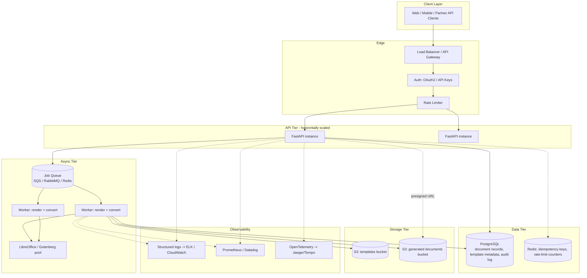

# From POC to Production: Real Services Migration Guide

This maps every POC shortcut in the current codebase to its production
equivalent: what to add, why, and how it slots into the existing module
boundaries (see [`architecture.md`](./architecture.md) for the current
structure and [`design-decisions.md`](./design-decisions.md) for why each
shortcut was taken in the first place).

The throughline: **every migration below is additive to `app/modules/documents/`
or a new sibling module — none require re-architecting the pipeline
(resolve → render → convert → store) itself.**

## Target-state architecture

---

## 1. Storage: local disk → S3 (or GCS / Azure Blob)

**Current**: `LocalFileStorage` (`app/modules/documents/storage.py`) writes
to a directory on the API process's own disk.

**Production**:
- New adapter `S3Storage` implementing the same two methods
  (`save(filename, content) -> location`, `find_existing(filename) ->
  location | None`), using `boto3`.
- `save()` uploads to a `generated-documents` bucket with
  server-side encryption (SSE-S3 or SSE-KMS) and a lifecycle rule
  (e.g. auto-delete after 90 days, or transition to Glacier).
- Downloads switch from `FileResponse` to a **redirect to a pre-signed
  URL** (`RedirectResponse(s3.generate_presigned_url(...))`) — the API
  process should not proxy file bytes at scale.
- Templates move to their own bucket (or prefix), fetched by
  `TemplateRepository` on resolve (with a local LRU cache to avoid
  fetching the same template on every request).

**Migration size**: one new file (`s3_storage.py`), one changed
constructor call in `service.get_document_service()`, one changed route
handler (`download_document` returns a redirect instead of
`FileResponse`). No change to `DocumentGenerationService`.

**Why now vs. later**: this is usually the *first* thing to fix, because
without it the service can't run more than one replica — a request
handled by instance A can't serve a file generated by instance B.

---

## 2. Persistence: no DB → PostgreSQL for document + template metadata

**Current**: No database. The only record of a generated document is its
filename in `generated/`.

**Production**:
- New `documents` table: `id (uuid pk)`, `document_type`, `version`,
  `output_format`, `storage_key`, `requested_by` (once auth exists),
  `status` (`pending`/`completed`/`failed`), `created_at`,
  `completed_at`, `error_detail`.
- New `templates` table (replaces pure filesystem convention from
  ADR-002): `document_type`, `version`, `storage_key`, `uploaded_by`,
  `uploaded_at`, `is_active`. `TemplateRepository.resolve()` becomes a
  DB query instead of (or in addition to, during transition) a directory
  scan.
- Use SQLAlchemy 2.0 + Alembic for migrations. Add a `app/modules/documents/models_db.py`
  (SQLAlchemy models) and `app/modules/documents/repository.py` (DB
  access), keeping `service.py`'s public interface unchanged — it calls
  `repository.record_generation(...)` instead of nothing.
- This immediately unlocks: `GET /documents?type=invoice&status=completed`,
  audit trails, and idempotency (see §6).

**Migration size**: moderate — new tables, a new adapter module, and
`DocumentGenerationService.generate()` gains two calls (record "pending"
before starting, update to "completed"/"failed" after). The
resolve → render → convert → store sequence itself does not change.

---

## 3. Async processing: synchronous request → job queue + workers

**Current**: `POST /documents/generate` blocks for the full pipeline,
including LibreOffice startup (see ADR-004, ADR-007). This is the
biggest scalability gap in the current design.

**Production**:
- `POST /documents/generate` becomes: validate request → insert a
  `documents` row with `status=pending` → publish a job
  (`{document_id, document_type, version, output_format, data}`) to a
  queue (SQS, RabbitMQ, or Redis+Celery) → return `202 Accepted` with
  `{document_id, status: "pending"}` immediately.
- A separate **worker process** (same `DocumentGenerationService` code,
  different entry point — a Celery task or an SQS consumer loop, not a
  FastAPI route) consumes jobs and runs the existing
  resolve → render → convert → store pipeline unchanged.
- Client either polls `GET /documents/{id}` (now meaningful, thanks to
  §2) or the API supports a webhook callback / WebSocket notification on
  completion.
- Workers scale independently from the API tier — CPU/memory-heavy PDF
  conversion no longer competes with request-handling capacity.

**Migration size**: the pipeline logic in `service.py` is reused
as-is — this is exactly why `DocumentGenerationService` was kept free of
any HTTP/FastAPI concern (see ADR-001, ADR-006 trade-off note). The new
work is: a queue client, a worker entry point (`worker.py` or a Celery
app), and a status-check endpoint.

**Why this matters**: without it, every concurrent PDF request spawns
its own `soffice` process inline in a request thread — the current code
already isolates each conversion via a per-call profile directory
(ADR-004) specifically so this scales *safely*, but it doesn't scale
*efficiently* until conversion is off the request path.

---

## 4. PDF conversion at scale: subprocess LibreOffice → dedicated service/pool

**Current**: `LibreOfficeConverter` shells out to `soffice` per request
(`app/modules/documents/conversion.py`).

**Production options, in order of operational simplicity**:
1. **Gotenberg** (open-source, Docker-based conversion API wrapping
   LibreOffice) — run as its own service, called over HTTP from the
   worker. Removes subprocess-management concerns from this codebase
   entirely; Gotenberg handles process pooling internally.
2. **A small internal microservice** that maintains a warm pool of
   `soffice` processes (avoids the ~1-2s cold-start per conversion) —
   more work to build, useful if Gotenberg's licensing/ops model doesn't
   fit.
3. **Managed API** (CloudConvert, Aspose Cloud) — zero infra to run, per
   conversion cost, external network dependency and data-residency
   considerations (documents may contain sensitive data).

**Migration size**: `LibreOfficeConverter` is replaced by e.g.
`GotenbergConverter` implementing the same `convert(docx_bytes) ->
bytes` method — one file, one constructor call, per ADR-005's designed
seam.

---

## 5. Auth & authorization: none → API keys / OAuth2

**Current**: Every endpoint is open (ADR-009).

**Production**:
- Simplest viable: API-key auth via a FastAPI dependency
  (`core/security.py`) checking a key against the `api_keys` table (or
  an external secrets/identity store), applied to
  `documents.router`'s `APIRouter(dependencies=[Depends(require_api_key)])`.
- Fuller version: OAuth2/OIDC via an identity provider (Auth0, Okta,
  Cognito), FastAPI validating JWTs, scopes like
  `documents:generate`, `documents:read`.
- Per-tenant scoping: if multiple customers use this service, every
  `documents` row (§2) and every S3 key (§1) gets a `tenant_id` prefix/
  column, and auth resolves to a tenant, not just a user.
- Rate limiting (per key/tenant) via `slowapi` or at the API gateway
  layer, to prevent one caller from exhausting LibreOffice/worker
  capacity.

**Migration size**: additive — a new `core/security.py`, a dependency
added to the existing router, no change to `service.py` or below.

---

## 6. Reliability: retries, idempotency, dead-letter handling

**Current**: A failed conversion returns an error to the caller and
nothing is retried; there's no way to safely retry a request without
risking duplicate generation.

**Production**:
- **Idempotency keys**: caller supplies an `Idempotency-Key` header;
  the API checks Redis/the `documents` table before enqueueing — a
  retried request with the same key returns the existing result instead
  of generating twice.
- **Worker retries**: transient failures (LibreOffice OOM, temporary S3
  error) get automatic retry with exponential backoff (native in
  SQS/Celery); permanent failures (bad template data) go to a
  dead-letter queue for manual/alerted inspection rather than retrying
  forever.
- **Health/readiness probes**: `/health` (already present) extended to
  check DB connectivity and queue reachability for k8s liveness/readiness.

---

## 7. Template management: convention → managed registry

**Current**: Any `.docx` matching `{type}_v{N}.docx` in `templates/` is
live immediately (ADR-002) — no validation, no approval step.

**Production**:
- Upload endpoint (`POST /admin/templates`) storing the file in S3 and a
  row in the `templates` table (§2) with `is_active=false`.
- A validation/dry-run step: render the new template against a sample
  payload before marking it active, catching malformed Jinja syntax
  (the `` row-loop gotcha from ADR-003 among others) before it
  can break a real request.
- Versioning and rollback: `is_active` flag per version lets you roll
  back to `v1` without deleting `v2`, and `GET /documents/types` reflects
  the DB instead of a directory scan.

---

## 8. Observability

**Current**: One `logging.getLogger("docket")` call, used only for
5xx-class errors (`core/errors.py`).

**Production**:
- **Structured logging**: JSON logs with `document_id`,
  `document_type`, `request_id`, shipped to CloudWatch/ELK/Datadog.
- **Metrics** (Prometheus via `prometheus-fastapi-instrumentator`, or
  StatsD/Datadog): generation latency by document type and format,
  conversion success/failure rate, queue depth, worker utilization.
- **Tracing** (OpenTelemetry): a trace spanning
  API → queue → worker → S3 makes it possible to see exactly where a
  slow or failed generation spent its time — critical once the pipeline
  is split across the API/worker boundary in §3.
- **Alerting**: on conversion backend unavailability
  (`ConversionUnavailableError` rate), queue depth exceeding a threshold,
  and DLQ arrivals.

---

## 9. Security hardening

Already present and worth keeping as-is: filename sanitization and
path-traversal rejection in `LocalFileStorage`/its S3 successor. Add:
- Secrets (DB credentials, S3 keys, API keys) via a secrets manager
  (AWS Secrets Manager / Vault), not `.env` files, once deployed.
- Template upload malware/macro scanning (a `.docx` is a zip archive —
  validate structure and strip/reject macros before storing).
- Dependency vulnerability scanning in CI (`pip-audit` / `safety`).
- Network policy: worker tier should not be internet-reachable; only the
  API tier sits behind the load balancer.

---

## 10. Deployment & infrastructure

**Current**: a single-stage `Dockerfile` (LibreOffice baked in, runs as a
non-root user, `HEALTHCHECK` included) plus a `docker-compose.yml` that
bind-mounts `templates/` and `generated/` for local development. This
covers "run the whole thing with one command" but is not yet a
production deployment artifact — there's one image, one process type,
and no orchestration.

**Production**:
- Move to a **multi-stage build** (separate build/runtime stages to keep
  the final image lean) and split into **two images/targets**: one for
  the API (no LibreOffice needed once conversion moves to Gotenberg/a
  managed API per §4) and one for the worker (needs the conversion
  dependency, or calls out to it) — both reuse the same `service.py`
  code, just different entry points (`uvicorn` vs. a queue-consumer
  loop).
- Orchestrate via Kubernetes or ECS: API and worker as separate
  Deployments/Services so they scale independently (§3).
- Infrastructure as code (Terraform) for S3 buckets, RDS (Postgres),
  the queue, and IAM roles/policies.
- CI/CD: lint (`ruff`/`pyflakes`) → test (`pytest`) → build image → push
  → deploy, with the existing test suite (service + router tests against
  real temp-dir adapters, per the current `tests/` design) extended with
  a Dockerized integration test that runs against real LibreOffice/
  Gotenberg rather than asserting only the "unavailable" error path.

---

## Suggested migration order

Each phase is independently shippable and builds on the last; none
requires touching `service.py`'s core pipeline logic.

| Phase | Scope | Unblocks |
|---|---|---|
| 1 | Storage → S3 (§1), DB for document + template records (§2) | Multiple API replicas, audit trail, `GET /documents` |
| 2 | Async queue + worker split (§3), dedicated conversion service (§4) | Real concurrency, no more request-blocking on PDF conversion |
| 3 | Auth (§5), idempotency/retries (§6) | Safe to expose beyond a trusted network |
| 4 | Template registry + validation (§7), observability (§8) | Non-engineers can manage templates safely; on-call can diagnose issues |
| 5 | Security hardening (§9), full IaC/CI-CD (§10) | Production-grade deployment |
